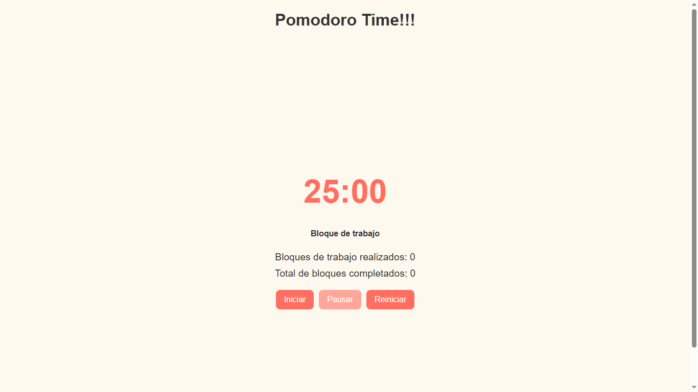
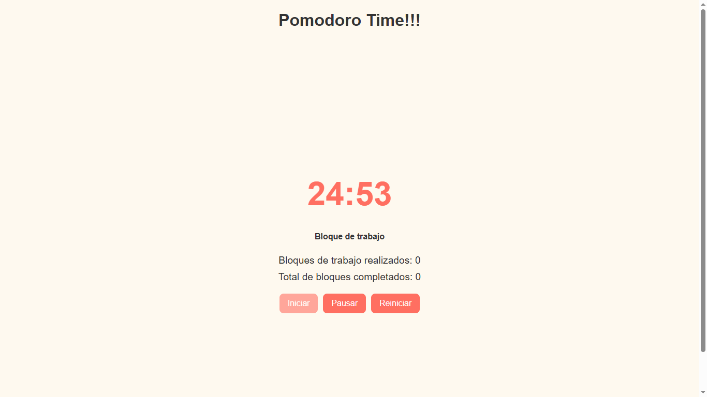
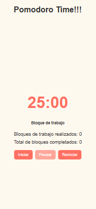

# ⏱️ Pomodoro Timer

Una aplicación Pomodoro simple y funcional construida con **React** y estilizada con **styled-components**.  
Permite administrar tus ciclos de trabajo y descanso siguiendo la técnica Pomodoro.

---

## 🏷️ Badges


---

## 🚀 Características

- Temporizador de **25 minutos de trabajo** y **5 minutos de descanso** (descanso largo cada 4 ciclos).
- Guarda los **bloques completados** en `localStorage`.
- Emite **sonido y vibración** al finalizar un bloque.
- Permite **iniciar, pausar y reiniciar** fácilmente.
- Interfaz moderna con **styled-components** y **ThemeProvider**.

---

## 🧩 Tecnologías utilizadas

- React
- styled-components
- JavaScript (Hooks: useState, useEffect, useRef)
- HTML5 / CSS3

---

## 📂 Estructura del proyecto

```
src/
├── components/
│ ├── Pomodoro.jsx
│ ├── styles/
│ │ ├── PomodoroStyles.js
│ │ └── GlobalStyles.js
├── theme.js
└── App.jsx
```

---

## 📸 Capturas

### Dashboard principal




### Vista móvil



---

## ⚙️ Instalación y ejecución

1. Clona este repositorio:

```
   git clone https://github.com/luisgutierrez11/pomodoro-app
```

2. Ingresa al directorio:

```
   cd pomodoro-timer
```

3. Instala las dependencias:

```
   npm install
```

4. Inicia el proyecto:

```
   npm run dev
```

El proyecto se ejecutará en **http://localhost:5173/** (o el puerto que indique Vite).

---

## 💡 Ideas de mejora futura

- Agregar **modo claro/oscuro** con ThemeProvider.
- Personalizar **tiempos de trabajo y descanso** desde la interfaz.
- Mostrar **gráficos de productividad** (bloques completados por día).
- Agregar **notificaciones del navegador**.

---

## 📜 Licencia

Este proyecto está bajo la licencia MIT — ver el archivo LICENSE para más detalles.

## 🧑‍💻 Autor

**Luis Gutiérrez**  
Proyecto desarrollado como práctica de React y estilización con Styled Components.

```
    📧 luis.gut.11jm@gmail.com
    🌐 https://github.com/luisgutierrez11
```
